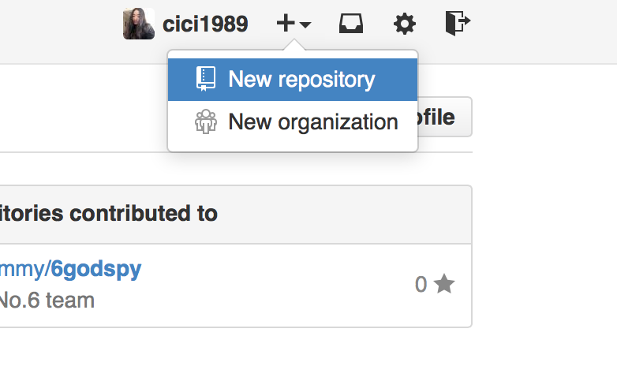
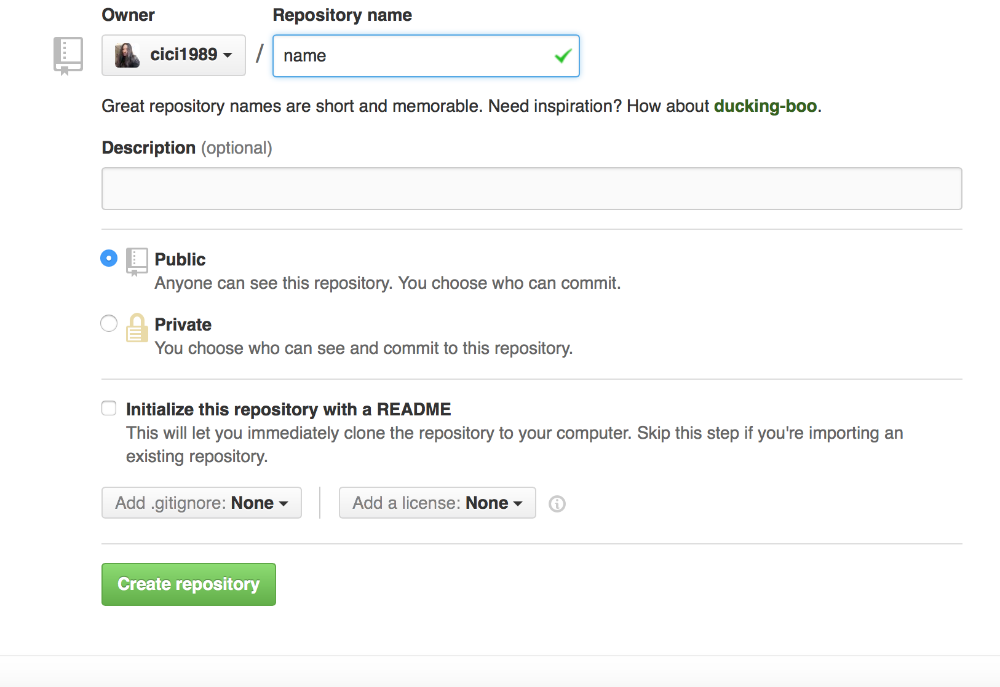
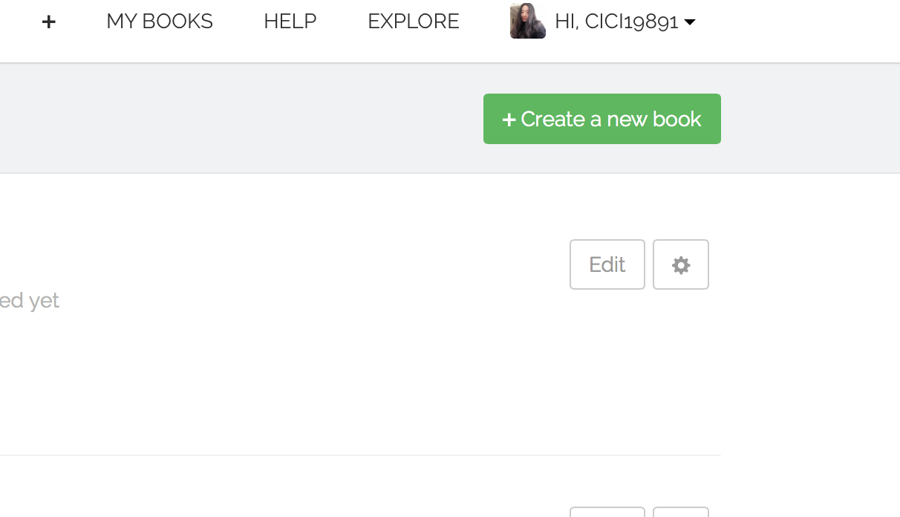
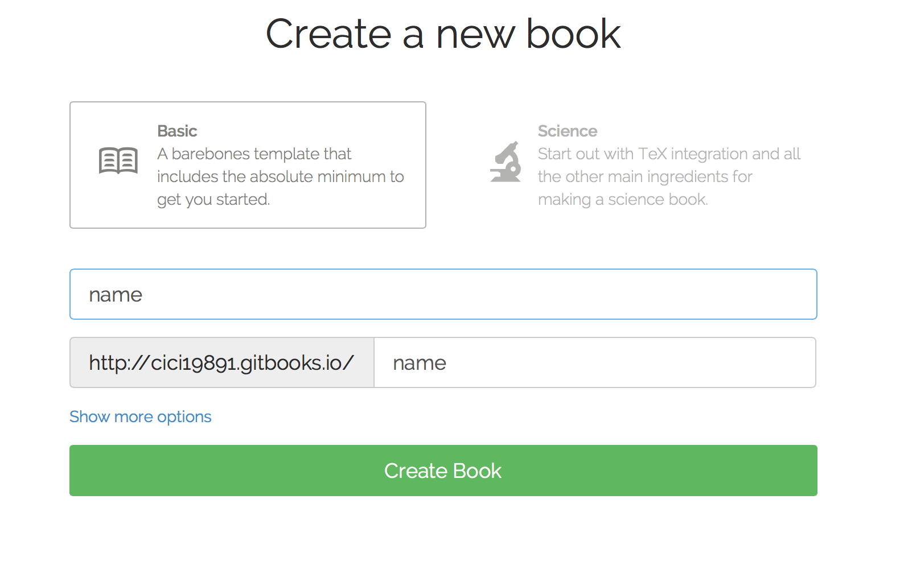

# 写给六个月前的自己——关联 GitHub 和 GitBook
## 解题思路
### 一. 搞定 GitHub 
#### 1.注册  [GitHub](https://github.com) 
#### 2.登陆
#### 3.入门
在 [GitHub Help](https://help.github.com) 学习如何使用 GitHub 。
> 如新建一个库，第三个步骤中会用到。 

也可以在 [GitHub Guides ](https://guides.github.com) 有针对性地深入学习。
### 二. 搞定 GitBook
#### 1.注册 [GitBook](https://www.gitbook.com)
可以用 GitHub 账号直接登陆。

>tips：不要忘记验证你的邮箱。如何验证请看下面的具体步骤。

#### 2.登陆
#### 3.入门
GitBook 非常简单，新建一个 book 就可以进入第三个步骤了。

在这个过程中会发现 GitBook 的使用不知不觉已经会了，而这时候你发现你接着需要学习的是 [Markdown]***等md写好后在这里插入教程链接***。

### 三. 关联两者
#### 1.确认已经在 GitHub 中建立了库。
#### 2.确认已经在 GitBook 中建立了 book 。
#### 3.关联库和 book 。
## 思路小结
经过上面三个大步骤你会发现 GitHub 和 GitBook 的关联已经完成了。

也许你会说，这么笼统的教程谁能懂呢？确实，这只是一个以程序员思维自居的人写的一个解决思路。当然刚入门的学习者有非常多的细节不明白，我也是那样过来的，所以我准备了具体步骤。

但我仍然希望你能够按照上面的思路自己折腾一遍，这样也许你以后遇到问题就能够首先分解为几个大步骤，每个步骤再进行分解，逐一找到解决的办法，就像编程过程中程序员遇到问题时写方法和调用方法一样。

沿着这个思路，当你还是遇到了没有办法解决的问题时，那通常是一个非常细节的问题，任何一个过来人都能明白你的问题出在哪里并帮你指出来，而不是一头雾水无法帮助你。
## 具体步骤
1. 注册并登陆 [GitHub](https://github.com) 。
2. 新建一个库，左上方的＋号下拉，点击 New repository。
3. 想一个炫酷的库名，我用 name 做示范。

点击 Creat repository 你就得到了一个你命名的库。

4. 用 GitHub 登陆 GitBook 。
5. 新建一个 book ，右上方的＋号或＋Creat a new book 。
6. 想一个炫酷的名字，我用关联的库相同的名字 name 。 点击 Creat book 你得到了一个你命名的 book 。
7. 